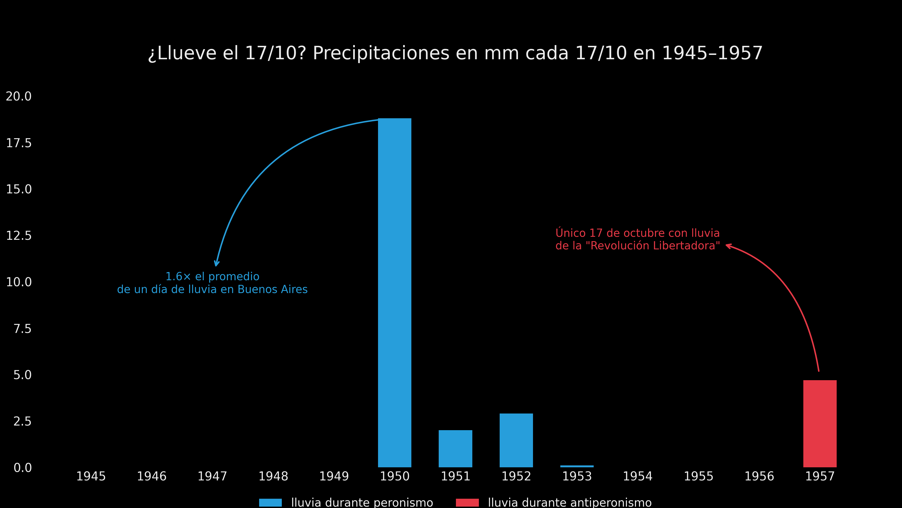
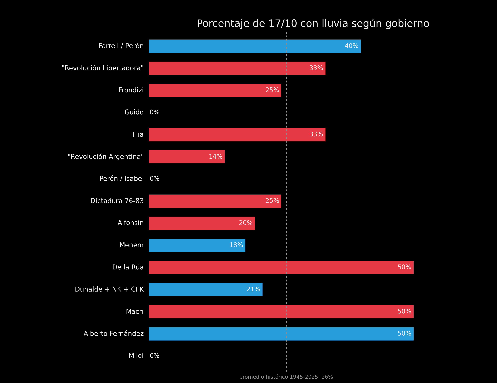
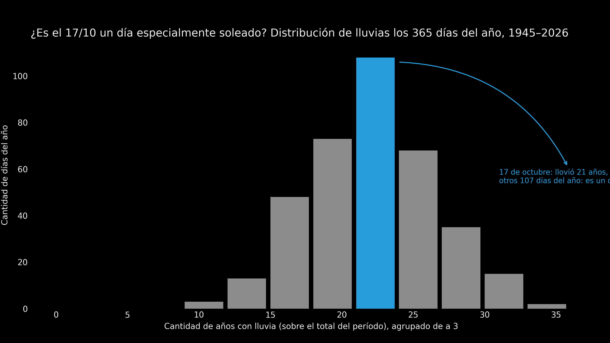

¿Es el 17/10 un "día peronista"?

Crucé los datos de lluvia diaria en Buenos Aires (estación OCBA/SMN) con un listado de años de gobierno peronista para ver si el 17 de octubre llueve más bajo un signo político que otro. Aislé la lluvia caída cada 17 de octubre entre 1945 y 2025 y la comparé según hubo o no peronismo ese año. Llovió en el 26% de los 17 de octubre peronistas y en el 26% de los no peronistas: no encontré diferencia.

Así se ve la lluvia año por año entre 1945 y 1957:

Agrupé el mismo dato por etapa de gobierno:

Y para poner el 17 de octubre en contexto, comparé cuántos años llovió ese día contra los otros 364 días del año:

